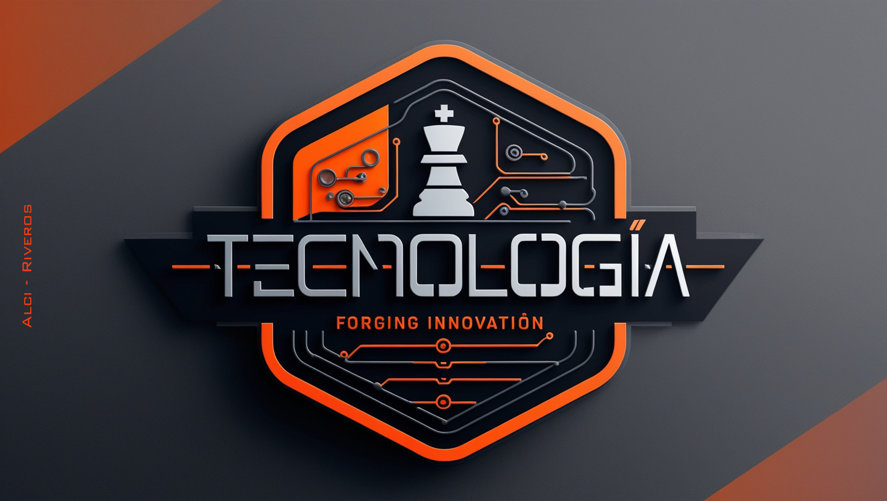

#  Bienvenido al GitHub de Hugo Alcides Riveros

¡Hola! Soy Estudiante de Ingeniería en Electrónica.
Además de mi enfoque en electrónica, he adquirido conocimientos en HTML y CSS, lo que me permite combinar la lógica y precisión de la ingeniería con la creatividad del desarrollo web. Mi objetivo es seguir aprendiendo, colaborar en proyectos desafiantes y contribuir con soluciones innovadoras.
## Tecnologias
Codigos

