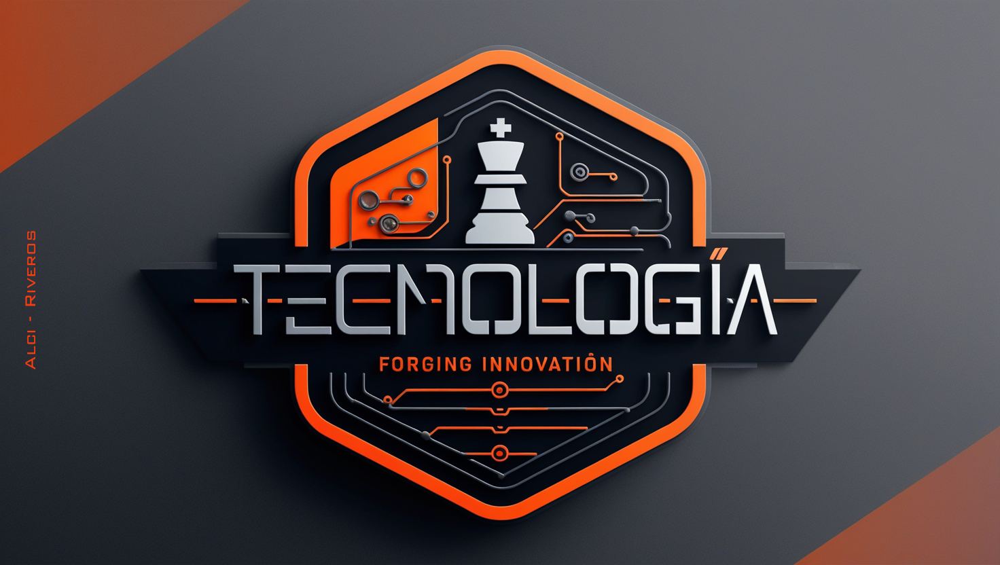

#  Bienvenido al GitHub de Hugo Alcides Riveros

Además de mi enfoque principal en **electrónica**, cuento con conocimientos en **IoT** para desarrollar **soluciones y seguridad**, así como en **HTML, CSS, C, C++, Java y JavaScript**. Esto me permite combinar la **lógica y precisión de la ingeniería** en mi campo de la electrónica con herramientas de desarrollo innovadoras. Mi objetivo es seguir aprendiendo, colaborar en proyectos desafiantes y contribuir con soluciones.
## Tecnologias
Hace click y Conoce mis Codigos 

